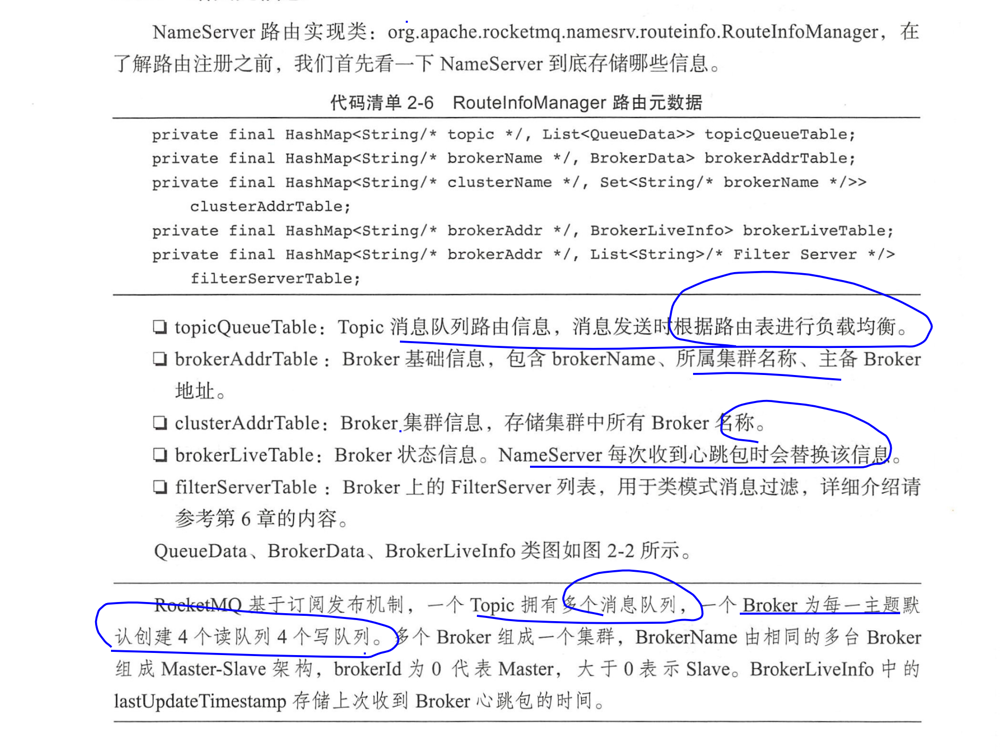
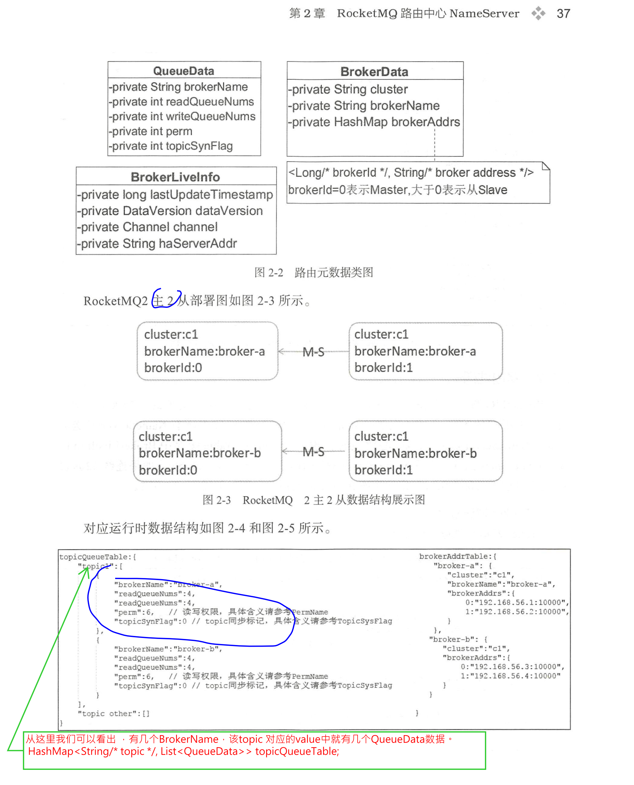
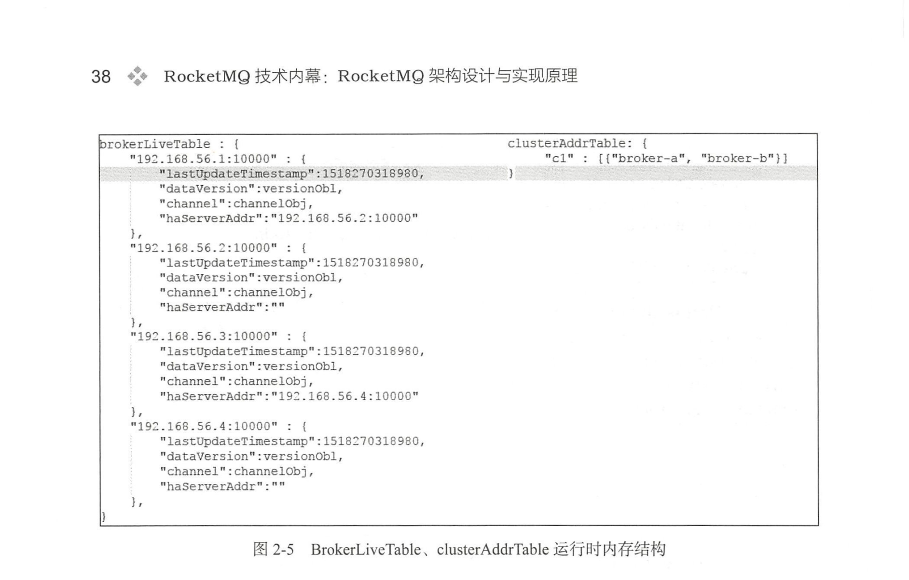

## 第二章RocketMQ路由中心NameServer

1，nameServer动态路由发现与剔除机制

Broker消息服务器在启动时向所有的NameServer注册,Broker启动时会创建定时任务每隔30秒向NameServer发送心跳包，心跳包中包含BrokerId，broker地址，Broker名称，所属集群等信息；NameServer与每台Broker服务器保持长连接，NameServer启动时会创建定时任务，每隔10s定期检查内存中的Broker活跃表，如果检测到长时间（120s）未收到Broker的心跳，则认定为Broker宕机，则从路由表中将其移除。但是路由变化不会马上通知消息生产者。为什么要这样设计？主要是为了降低NameServer实现的负载型，在消息发送端提供容错机制来保证消息发送的高可用性


2， 消息服务器（Broker）根据订阅信息（路由信息）将消息推送到消费者（PUSH模式）或者消息消费者主动向消息服务器拉取消息（PULL 模式）从而实现生产者与消息消费者解耦。


3，消息生产者如何知道消息要发往哪台消息服务器呢？

消息生产者在发送消息之前先从NameServer获取Broker服务器地址列表，然后根据负载均衡算法从列表中选择一台消息服务器进行消息发送。


4，如何避免NameServer的单点故障，提供高可用性呢


NameServer本身的高可用可通过部署多台NameServer服务器来实现，但彼此之间互不通信，也就是nameServer服务器之间在某一时刻的数据并不会完全相同，但这对消息发送不会造成任何影响，这也是RocketMQ nameServer设计的一个亮点，RocketMQNameServer设计追求简单高效。


5，如果某一台消息服务器Broker宕机了，那么生产者如何在不重启服务的情况下感知呢？


NameServer主要是为了解决（1,3,5）问题


====================================

NameServer主要作用是为消息生产者和消息消费者提供关于Topic的路由信息，NameServer需要存储路由的基础信息，还要能够管理Broker节点，包括路由注册、路由删除（故障剔除）


------


数据结构解释：








在这里重点关注的是QueueData， 从上面图片中我们看到  这个Topic有几个BrokerName对应就会有几个QueueData。

因为在每一个BrokerName的master-slave结构中，只有master节点能够写入数据，因此master节点上为该Topic创建的写队列的个数就是QueueData中的writeQueueNums。

slave节点 和master节点都支持对外提供读，因此都有读队列。


问题： slave Broker节点 上读队列的数量是如何确定的？  是不是说如果master上有3个读队列，每一个slave上就会有三个读队列？


---------------

2.3.4 路由发现

 RocketMQ的路由发现是非实时的，当Topic路由出现变化后，nameServer不主动推送给客户端，而是由客户端定时拉取最新的路由。（注意是定时拉取最新的路由，也就是consumer和Producer存在定时任务），如下MQClientInstance

```java
        /**
         * 第二个定时任务
         * 
         * 非常重要的任务：
         *  RocketMQ的路由发现是非实时的，当Topic路由出现变化后，nameServer不主动推送给客户端，
         *  而是由客户端定时拉取最新的路由。（注意是定时拉取最新的路由，也就是consumer和Producer存在定时任务）
         * 
         * 
         * MQClient 端启动定时任务 更新topic的路由信息。 具体更新哪些路由 会从consumerTable ，producerTable中遍历每一个consumer
         * producer，取出其中的topic，然后更新每一个topic的路由信息
         *
         * MQClientInstance.updateTopicRouteInfoFromNameServer(String, boolean, DefaultMQProducer)  (org.apache.rocketmq.client.impl.factory)
         *     MQClientInstance.updateTopicRouteInfoFromNameServer(String)  (org.apache.rocketmq.client.impl.factory)
         *         MQClientInstance.updateTopicRouteInfoFromNameServer()  (org.apache.rocketmq.client.impl.factory)
         *       这一步     Anonymous in startScheduledTask() in MQClientInstance.run()  (org.apache.rocketmq.client.impl.factory)
         *                 MQClientInstance.start()  (org.apache.rocketmq.client.impl.factory)
         *                     DefaultMQPushConsumerImpl.start()  (org.apache.rocketmq.client.impl.consumer)
         *                         DefaultMQPushConsumer.start()  (org.apache.rocketmq.client.consumer)
         *                     DefaultMQPullConsumerImpl.start()  (org.apache.rocketmq.client.impl.consumer)
         *                     DefaultMQProducerImpl.start(boolean)  (org.apache.rocketmq.client.impl.producer)
         *
         * 这里的定时任务会调用 MQClientInstance的updateTopicRouteInfoFromNameServer
         */
        this.scheduledExecutorService.scheduleAtFixedRate(new Runnable() {

            @Override
            public void run() {
                try {
                    MQClientInstance.this.updateTopicRouteInfoFromNameServer();
                } catch (Exception e) {
                    log.error("ScheduledTask updateTopicRouteInfoFromNameServer exception", e);
                }
            }
        }, 10, this.clientConfig.getPollNameServerInterval(), TimeUnit.MILLISECONDS);
```


问题：NameServer需要等Broker失效至少120S 才能将该Broker从路由表中移除，name如果在Broker故障期间，消息生产者根据主题获取到的路由信息包含了已经宕机的Broker，会导致消息发送失败，那么这种情况该怎么办，岂不是消息发送不是高可用的？


------------

## 第三章 rocketMQ消息发送


1，RocketMQ发送普通消息有三种实现方式：可靠同步发送、可靠异步发送、单项（OneWay）发送。

发送者向 MQ 执行发送消息 API 时，同步等待， 直到消息服务器返回发送结果 。

异步 ： 发送者向 MQ 执行发送消息 API 时，指定消息发送成功后的回掉函数，然后调
用消息发送 API 后，立即返回，消息发送者线程不阻塞 ，直到运行结束，消息发送成功或
失败的回调任务在一个新的线程中执行。

单向：消息发送者向 MQ 执行发送消息 AP I 时，直接返回，不等待消息服务器的结果，
也不注册回调函数，简单地说，就是只管发，不在乎消息是否成功存储在消息服务器上。

同步阻塞的实现原理是： 首先为请求创建一个唯一id 和一个表示请求响应的对象ResponseFeature，然后将这两个对象作为key ,value 存储到一个Map中，这个map（responseTable）其实就是表示等待的响应表。然后调用Net通用的io.netty.channel.Channel#writeAndFlush(java.lang.Object)方法将请求发送出去，这个writeAndFlush方法不会阻塞等待响应，同时在发送的 时候给这个channle注册了一个Listener，在消息发送成功或者消息发送失败的时候都会回调Listener的方法，在Listener内判断如果发送失败则调用countDownLatch.countDown(); 从而唤醒发送消息的线程。。因为writeAndFlus不会阻塞当前线程，所以当前线程write之后继续执行，在ResponseFeature对象中有一个countDownLatch属性（new CountDownLatch(1);），write之后我们会调用countDownLatch.await(timeoutMillis, TimeUnit.MILLISECONDS); 从而实现当前发送消息线程的 限时阻塞。

同时RocketMQ中提供了Handler用于处理接收到的消息，在接收到响应的时候会首先提取响应中的请求id，然后在responseTable取出ResponseFeature，同时调用countDownLatch.countDown(); 从而唤醒发送消息的线程

```java
//消息发送同步阻塞
          channel.writeAndFlush(request).addListener(new ChannelFutureListener() {
                @Override
                public void operationComplete(ChannelFuture f) throws Exception {
                    if (f.isSuccess()) {
                        responseFuture.setSendRequestOK(true);
                        return;
                    } else {
                        responseFuture.setSendRequestOK(false);
                    }

                    responseTable.remove(opaque);
                    responseFuture.setCause(f.cause());
                    responseFuture.putResponse(null);
                    log.warn("send a request command to channel <" + addr + "> failed.");
                }
            });

            RemotingCommand responseCommand = responseFuture.waitResponse(timeoutMillis);


// 注意这个waitResponse方法是ResponseFuture对象中的方法，在waitResponse方法内 会调用countDownLatch await阻塞当前发送线程。
//同时 ResponseFuture对象的 responseCommand属性 会在 netty接收到响应的时候在netty线程中 将响应中的数据更新到属性responseCommand中
//所以ResponseFuture中的responseCommand属性存在多线程并发共享，需要使用volatile
 public RemotingCommand waitResponse(final long timeoutMillis) throws InterruptedException {
        this.countDownLatch.await(timeoutMillis, TimeUnit.MILLISECONDS);
        return this.responseCommand;
  }


//请求响应处理：唤醒消息发送线程处理消息

class NettyClientHandler extends SimpleChannelInboundHandler<RemotingCommand> {

        @Override
        protected void channelRead0(ChannelHandlerContext ctx, RemotingCommand msg) throws Exception {
            processMessageReceived(ctx, msg);// 这个process过程中会
            //ResponseFuture responseFuture = responseTable.get(opaque);
            //  responseFuture.putResponse(cmd);
            //responseFuture.countDownLatch.countDown() 唤醒消息发送线程
        }
    }

```


2，RocketMQ消息发送需要靠来几个问题： 

- 消息队列如何进行负载
- 消息发送如何实现高可用
- 批量消息发送如何实现一致性


3，消息队列如何进行负载

我们知道在NameServer的路由信息中一个Topic 有几个brokerName，就会有几个QueueData，每一个QueueData会存储这个BrokerName中的所有brokerId，

生产者通过向nameServer查询topic的 路由信息，对返回的结果进行处理，在返回的结果中 会重点分析每一个QueueData; QueueData 中的writeQueueNums表示写队列的个数，实际上就是对应着该BrokerName中的master Broker节点上的该topic的写队列的个数。此时对于生产者来说他关系的是每一个QueueData中的writeQueueNums， 也就是关心每一个BrokerName下的 master Broker节点上的该topic的写队列的个数，然后为每一个写队列创建一个MessageQueue对象，最终Producer发送消息的时候会选择一个MessageQueue，将消息发送到该MessageQueue中。

```java
org.apache.rocketmq.client.impl.factory.MQClientInstance#topicRouteData2TopicPublishInfo
for (QueueData qd : qds) {
        /**
                     * 如果在改brokerName的 broker节点中 没有master节点则返回
                     */
                    if (!brokerData.getBrokerAddrs().containsKey(MixAll.MASTER_ID)) {
                        continue;
                    }
       for (int i = 0; i < qd.getWriteQueueNums(); i++) {
                        MessageQueue mq = new MessageQueue(topic, qd.getBrokerName(), i);
                        info.getMessageQueueList().add(mq);
        }
     
 }
```


4，消息发送如何实现高可用

**首先消息发送端采用重试机制** ，由 retryTimes WhenSendFailed 指 定 同步方式重试次
数 ，异步重试机制在收到消息发送结构后执行回调之前进行重试。 由 retryTimes When Send-
AsyncFailed 指定，接下来就是循环执行 ， 选择消息队列 、发送消息，发送成功则返回，收
到异常则重试。 

 选择消息队列有两种方式 。
1 )  sendLatencyFaultEnable=false ，默认不启用 Broker 故障延迟机制 。
2 )  sendLatencyFaultEnable=true ，启用 Broker 故障延迟机制 。


在不启用故障延迟的情况下会有什么问题呢？ 发送消息的时候我们需要选择一个MessageQueue，如果因为Broker宕机导致第一次发送失败了，那么第二次选择MessageQueue的时候要规避同一个Broker的MessageQueue。 在RocketMQ的 selectOneMessageQueue(lastBrokerName);方法中进行选择MessageQueue，其中参数lastBrokerName表示上一次发送失败的BrokerName，因此第一次发送的时候为null,第二次发送的时候为第一次发送失败的MessageQueue所在的BrokerName， 如果第二次发送失败了，那么我们第三次选择的时候 lastBrokerName就是第二法发送失败的BrokerName，那么这个时候第三次选择MessageQueue的过程中无法规避选中第一次发送失败的BrokerName的MessageQueue。

消息发送很有可能会失败，再次引发重试，带来不必要的性能损耗，那么有什么方法在一次消息发送失败后，暂时将该 Broker 排除在消息队列选择范围外呢？


或许有朋友会问， Broker 不可用后 ，路由信息中为什么还会包含该 Brok町的路由信息呢？其实这不难解释：首先， NameServer 检测 Broker 是否可用是有延迟的，最短为一次心跳检测间 隔（ 1 0s ）； 其次， NameServer 不会检测到 Broker 岩机后马上推送消息给消息生产者，而是消息生产者每隔 30s 更新一次路由信息，所以消息生产者最快感知 Broker 最新的路由信息也需要 30s 。 如果能引人一种机制，在 Broker 若机期间，如果一次消息发送失败后，可以将该 Broker 暂时排除在消息队列的选择范围中 。


故障延迟机制的原理就是：消息发送失败的是时候 创建一条发送失败记录，记录broker和故障延迟时间，指定该broker在未来的故障延迟时间内不能发送消息。这个故障延迟时间 可以使用固定的30秒，也可以根据消息发送开始时间到消息发送失败时的差值时间 来计算一个时间作为故障延迟时间，差值时间越大计算得到的故障延迟时间越大，故障延迟时间就是broker要规避 的时长。接下来多久的时间内该 Broker 将不参与消息发送队列负载。此时消息发送时会顺序选择MessageQueue，然后判断这个MessageQueue是否可用，判断的依据就是根据发送失败记录。


----------------

3.4.4 消息发送


